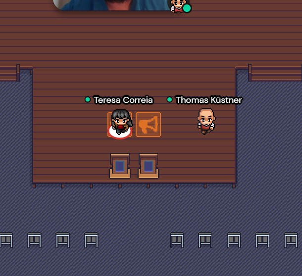
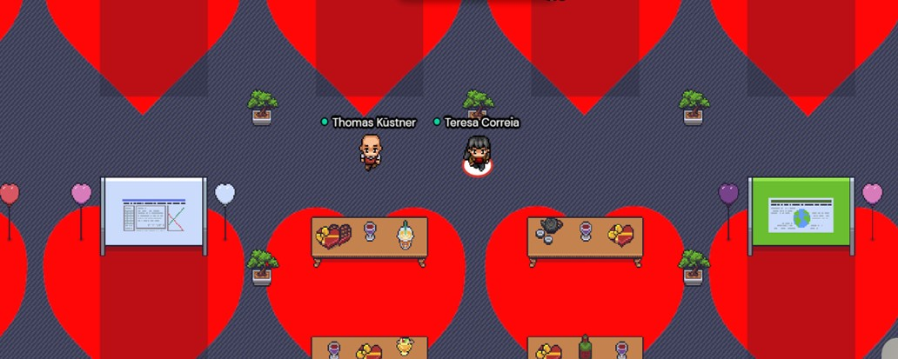
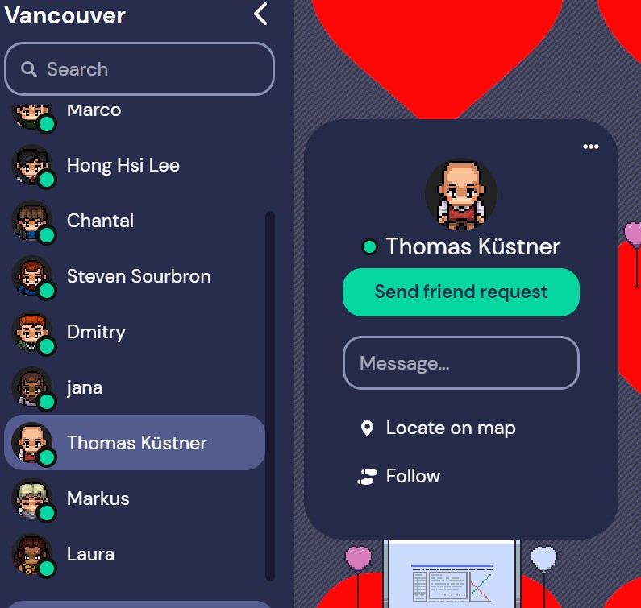

# 🏆 Awards Session

<nav>
  <ul>
    <table>
    <tr>
    
      
        <td>
          <a href="{{ site.url }}{{ nav.href }}">{{ nav.title }} ▼</a>
          <ul>
          
            <li><a href="{{ site.url }}{{ subcategory.subhref }}">{{ subcategory.subtitle }}</a></li>
          
          </ul>
        </td>
      
         <td class="active">
           <a href="{{ nav.url }}">{{ nav.title }}</a>
         </td>
       
        <td>
          <a href="{{ site.url }}{{ nav.href }}">{{ nav.title }}</a>
        </td>
      
    
      </tr>
    </table>
  </ul>
</nav> 

## Description
[Awards session: Thursday, May 20 2021, 18:00 - 19:00 UTC](https://www.ismrm.org/21/program-files/T-31.htm) 
The awards session will take place in the **Discovery rooms** within the Captain George Vancouver Tutorial spaces of the ISMRM's **gather.town** space:

Link: *coming soon*

Please sign in with the password received from the conference. Then, type in your full name (first name & last name) as you first enter the space so others can recognize you (this is your conference badge!). You will find the tutorial spaces to your left as you enter the Mount Seymour lobby. 

1️⃣ At the **beginning of the session**, please go inside the **Discovery lecture hall** and **join the Zoom call** for instructions. You can join the zoom call by clicking "x" as soon as you see a "telephone" sign lighting up yellow. Please note: in some browsers it may be necessary to mute yourself in gather.town as you join the zoom call. The first part of the session will consist of presentations of the solutions and the award ceremony itself. 

**The presentation can also be viewed live outside of gather.town by following the link provided by ISMRM for this session.**

2️⃣ The **second part of the session** will consist of a poster session in the **Discovery poster hall**, where the solutions are displayed with opportunity for networking and discussion with the submitters.

🆘 If you’re having trouble finding the Discovery rooms you can search for Teresa Correia and Thomas Küstner in the *Participants* menu. Then, you can use **Locate on map** to find them. They will be waiting for you in the Discovery room!  

🛈 Gather 101 - how to use and move:
[https://support.gather.town/help/movement-and-basics](https://support.gather.town/help/movement-and-basics)
