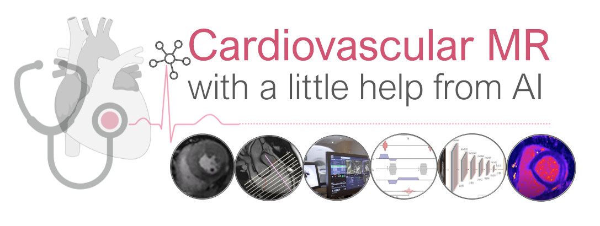

# ISMRM 2022 Member initiated tutorial

<nav>
  <ul>
    <table>
    <tr>
    
      
        <td>
          <a href="{{ site.url }}{{ nav.href }}">{{ nav.title }} ▼</a>
          <ul>
          
            <li><a href="{{ site.url }}{{ subcategory.subhref }}">{{ subcategory.subtitle }}</a></li>
          
          </ul>
        </td>
      
         <td class="active">
           <a href="{{ nav.url }}">{{ nav.title }}</a>
         </td>
      
        <td>
          <a href="{{ site.url }}{{ nav.href }}">{{ nav.title }}</a>
        </td>
      
    
      </tr>
    </table>
  </ul>
</nav>

## Overview
Cardiovascular disease (CVD) is the leading single cause of morbidity and mortality worldwide. Therefore, improving prevention, diagnosis and treatment of CVD is a global priority. Cardiovascular magnetic resonance (CMR) has emerged as a clinically important technique for the assessment of cardiac anatomy, function, perfusion and viability. However, diversity and complexity of methods pose limitations to the widespread use of CMR, which has become even more evident with the recent developments in artificial intelligence (AI). In addition, questions are being raised about how AI will affect the role of clinicians working in CMR and its trustworthiness. Hence, it is necessary to bridge the gap between the clinical and scientific communities. 
The tutorial at the ISMRM 2022 annual meeting on **Tuesday 10th of May 2022, 09:15 to 11:15 UTC+1** will cover in four talks different aspects of CMR:  
1. CMR methods for identifying CVD
2. Conduction and planning of a complete CMR exam
3. Parametric mapping, functional imaging techniques and motion correction strategies
4. Image reconstruction and analysis methods

Sessions 1 and 2 will provide a clinical background and indicate emerging AI solutions and raise the need for AI-assisted processing. Sessions 3 and 4 cover state-of-the-art methods and current research developments with focus on recent advances in AI for CMR.

## Target Audience
Physicians, radiographers, physicists, engineers, who wish to understand the role of AI in clinical CMR for acquisition, reconstruction and analysis.

## Educational objectives
* Understand basic cardiac anatomy, cardiovascular diseases, and its characterization by CMR and other diagnostic tools
* Describe the basic CMR examination and recognize the advantages and limitations of the technique
* Explain the basics of multi-multiparametric, quantitative imaging, and motion correction
* Explain the basics of deep learning-based methods for AI-assisted CMR with focus on image reconstruction and quantitative analysis

## Session
[Tutorial session: Tuesday 10th of May 2022, 09:15 - 11:15 UTC+1](https://submissions.mirasmart.com/ISMRM2022/Itinerary/ConferenceMatrixEventDetail.aspx?ses=MIT-01) 

### Organization/moderation
[Teresa Correia](https://www.ccmar.ualg.pt/users/tmcorreia) & [Thomas Küstner](http://www.midaslab.org/people.html)

### Speakers
1. Tevfik F. Ismail, MD, PhD, FSCMR 
King's College London, United Kingdom 
**Clinical Cardiovascular MR: Artificial intelligence, Friend or Foe?**
2. Wendy Strugnell, BSc (MIT), FSMRT 
Queensland X-Ray, Mater Hospital Brisbane, Australia 
**Scanning & Planning the Future of Cardiovascular MR**
3. Sebastian Weingärtner, PhD 
Delft University of Technology, Netherlands 
**Can You & (A)I Learn the Physics Behind Cardiovascular MR?**
4. Kerstin Hammernik, PhD 
Technical University of Munich, Germany 
**Deep Cardiovascular MR: Am (A)I Hallucinating?**
