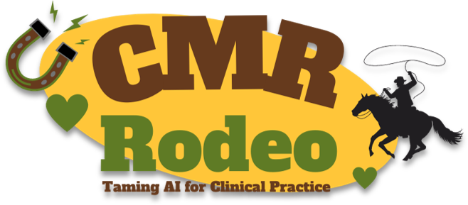

# ISMRM 2023 Member initiated tutorial: The Cardiac MRI Rodeo - Taming AI for Clinical Practice

<nav>
  <ul>
    <table>
    <tr>
    
      
        <td>
          <a href="{{ site.url }}{{ nav.href }}">{{ nav.title }} ▼</a>
          <ul>
          
            <li><a href="{{ site.url }}{{ subcategory.subhref }}">{{ subcategory.subtitle }}</a></li>
          
          </ul>
        </td>
      
         <td class="active">
           <a href="{{ nav.url }}">{{ nav.title }}</a>
         </td>
      
        <td>
          <a href="{{ site.url }}{{ nav.href }}">{{ nav.title }}</a>
        </td>
      
    
      </tr>
    </table>
  </ul>
</nav>

## Overview
This tutorial brings together physicians, physicists, engineers, radiographers, and AI scientists to educate, using examples, about the basics and challenges of CMR and the role of AI in clinics. It aims to provide a clinical background, indicate emerging AI methods and discuss the need for AI-assisted solutions. It will cover state-of-the-art acquisition, reconstruction and motion correction methods and current AI research. In this CMR Rodeo, speakers will take turns presenting short reviews of each topic - how it is currently done, what is missing and how can artificial intelligence help - for different CMR cases, which challenges the other speakers and audience to join the rodeo in a panel discussion. Each speaker will talk for about 5 min followed by Q&A and panel discussion of about 15 min. There will be 3 rounds in this CMR Rodeo! We are counting on your participatation! Prizes will be given out each go-round. Get your ropes ready!

The tutorial at the ISMRM 2023 annual meeting on **Wednesday 7th of June 2023, 15:45 to 17:15 UTC-4** will host five speakers talking about different aspects of CMR:  
1. CMR methods for identifying CVD
2. Conduction and planning of a complete CMR exam
3. Parametric mapping and functional imaging techniques
4. Motion correction strategies and image quality optimizations/tradeoffs
5. Image reconstruction and analysis methods

## Target Audience
Physicians, radiographers, physicists, engineers, who wish to understand the role and limitations of AI in clinical CMR.

## Educational objectives
*	Understand basic cardiac anatomy, cardiovascular diseases, and its characterization by CMR and other diagnostic tools
*	Describe the basic CMR examination and recognize the advantages and limitations of the technique
*	Explain the basics of CMR imaging and motion correction
*	Explain the basics of deep learning-based methods for AI-assisted CMR with focus on image reconstruction

## Session
CMR Rodeo: Wednesday 7th of June 2023, 15:45 to 17:15 UTC-4 

### Organization/moderation
[Teresa Correia](https://www.ccmar.ualg.pt/users/tmcorreia) & [Thomas Küstner](http://www.midaslab.org/people.html)

### Speakers
1. Imran Rashid , MD, PhD 
Cleveland Hospital, USA 
**Clinical CMR: What You See and What You Get**
2. Sarah Green, MSc 
Pacific Radiology Canterbury, New Zealand 
**CMR exam: Make it Right for Patients**
3. Jessica Bastiaansen, PhD 
University of Bern, Switzerland 
**CMR Pulses: Be Prepared for the Changes**
4. Michael Salerno, MD, PhD 
Radiology Department, Stanford, USA 
**CMR Image Quality: No Free Lunch**
5. Chen Qin, PhD 
Imperial College London, United Kingdom 
**Deep CMR: Getting it to Work**
