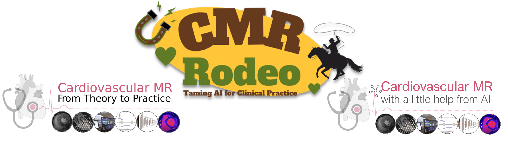

## Cardiovascular MR

<nav>
  <ul>
    <table>
    <tr>
    
      
        <td>
          <a href="{{ site.url }}{{ nav.href }}">{{ nav.title }} ▼</a>
          <ul>
          
            <li><a href="{{ site.url }}{{ subcategory.subhref }}">{{ subcategory.subtitle }}</a></li>
          
          </ul>
        </td>
      
         <td class="active">
           <a href="{{ nav.url }}">{{ nav.title }}</a>
         </td>
      
        <td>
          <a href="{{ site.url }}{{ nav.href }}">{{ nav.title }}</a>
        </td>
      
    
      </tr>
    </table>
  </ul>
</nav>

## Overview
Cardiovascular magnetic resonance (CMR) has emerged as a clinically important technique for the assessment of cardiac anatomy, function, perfusion and viability. However, diversity and complexity of imaging and reconstruction methods pose some limitations to the widespread use of CMR. Therefore, it is necessary to bridge the gap between the clinical and scientific communities.
We hosted two ISMRM Member initiated tutorials at the
- [ISMRM 2021](Tutorial_session.md): Cardiovascular MR - From Theory to Practice
- [ISMRM 2022](ISMRM_2022.md): Cardiovascular MR - With a little help from AI
- [ISMRM 2023](ISMRM_2023.md): The Cardiac MRI Rodeo: Taming AI for Clinical Practice

annual meetings which covered the topics:

1. CMR methods for identifying cardiovascular disease with a case-based tutorial
2. Conduction and planning of a complete CMR exam
3. CMR pulse sequence building
4. Artificial intelligence for CMR image analysis and reconstruction
5. Potentials, pitfalls and challenges of artificial intelligence for CMR
6. Panel discussion on current challenges and future directions of CMR

We provide [hands-on tutorials](Challenges.md), a [live scanning video demonstration](encrypted.html) and [teaching material](ISMRM_2022.md). The presented topics are summarized in a [review paper](https://www.frontiersin.org/articles/10.3389/fcvm.2022.826283/full):

```
@ARTICLE{10.3389/fcvm.2022.826283,
AUTHOR={Ismail, Tevfik F. and Strugnell, Wendy and Coletti, Chiara and Božić-Iven, Maša and Weingärtner, Sebastian and Hammernik, Kerstin and Correia, Teresa and Küstner, Thomas},   
TITLE={Cardiac MR: From Theory to Practice},      
JOURNAL={Frontiers in Cardiovascular Medicine},      
VOLUME={9},      
YEAR={2022},      
URL={https://www.frontiersin.org/article/10.3389/fcvm.2022.826283},       
DOI={10.3389/fcvm.2022.826283},      
ISSN={2297-055X},   
}
```

## Target Audience
Physicians, radiographers, physicists, engineers, who wish to understand the main clinical applications of CMR, acquisition and reconstruction methods. The tutorial is suitable for beginners in the field and for more advanced users to refresh or deepen their understanding on different aspects of CMR.

## Educational objectives
* Understand basic cardiac anatomy, cardiovascular diseases, and its characterization by CMR and other diagnostic tools
* Describe the basic CMR examination and recognize the advantages and limitations of the technique
* Explain the basics of anatomical, functional, multi-multiparametric and quantitative imaging
* Explain the basics of deep learning-based methods for image analysis and reconstruction
* Understand the potentials and challenges of artificial intelligence for CMR

## Challenges
[CMR physics challenge](CMR-physics-challenge.md)<br/>
[CMR deep learning reconstruction challenge](CMR-deep-learning-reconstruction-challenge.md)

## Live scanning
[Live scanning video](encrypted.html)

## Organization/moderation
[Teresa Correia](https://www.ccmar.ualg.pt/users/tmcorreia) & [Thomas Küstner](http://www.midaslab.org/people.html)
